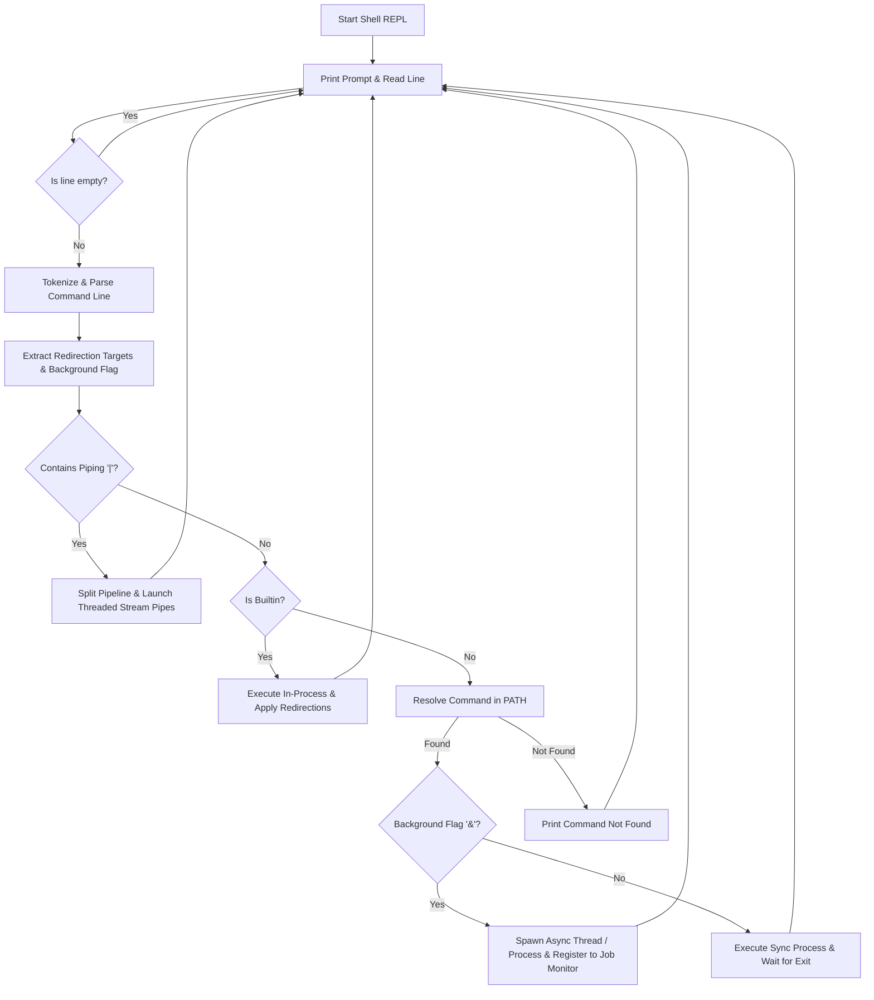
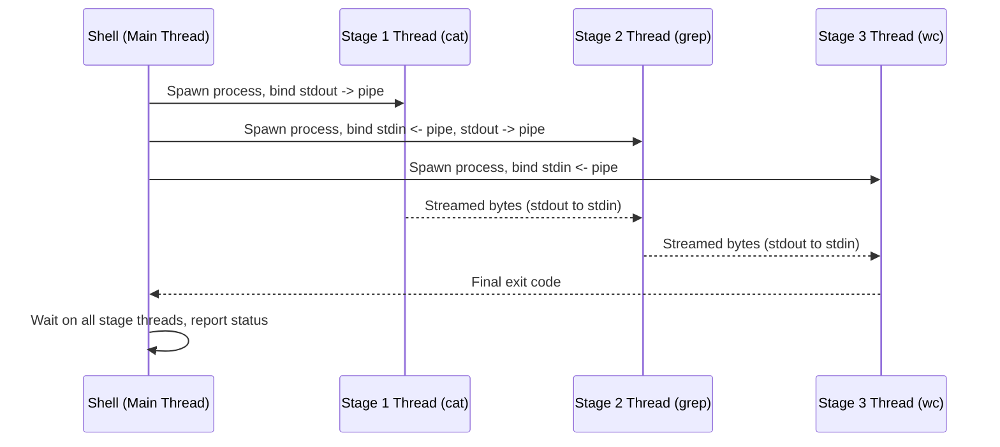
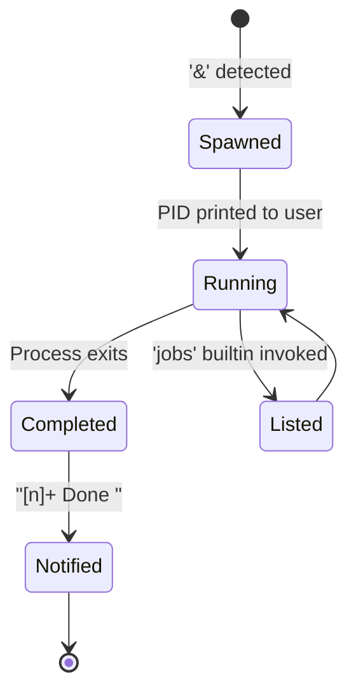

[](https://app.codecrafters.io/users/nipunkalsotra?r=2qF)

<div align="center">

# 🐚 Custom POSIX-Compliant Java Shell

### A high-performance, multi-threaded Unix-like shell — built entirely in modern Java 26

[](https://openjdk.org/)
[](https://maven.apache.org/)
[](https://app.codecrafters.io/courses/shell/overview)
[](LICENSE)
[]()

Command parsing • Quote handling • Redirection • Pipelines • Background jobs • Builtins

</div>

---

## ⚡ Live Terminal Demonstration

A simulated, real-time animation of the shell parsing input, resolving executables, handling redirection, piping between processes, and managing background jobs.

<div align="center">
  
</div>

> 💡 Want this exact animation? Regenerate it any time with [`terminalizer`](https://github.com/faressoft/terminalizer) or [`svg-term-cli`](https://github.com/marionebl/svg-term-cli) — see [Regenerating the Demo](#-regenerating-the-demo).

---

## 🚀 Key Features

<table>
<tr>
<td width="50%" valign="top">

### 🔁 Core REPL
- Prompts with `$ ` and handles interrupts gracefully
- Skips empty input & trims whitespace-padded lines
- Graceful `exit` handling with cleanup of background jobs

### 🧩 Quote-Aware Parser
- Single quotes `'...'` → fully literal content
- Double quotes `"..."` → backslash escaping (`\"`, `\\`)
- Unquoted backslash escapes (`\`)

### 🔍 Command Resolution
- Built-in dispatch table for native commands
- Dynamic `PATH` lookup for external executables
- Graceful `command not found` errors

</td>
<td width="50%" valign="top">

### 🔀 Redirection Engine
- Stdout: write `>` `1>` / append `>>` `1>>`
- Stderr: write `2>` / append `2>>`
- Works transparently across builtins & external processes

### 🧵 Multi-Stage Pipelines (`|`)
- N-stage pipelines via threaded I/O streams
- Each stage runs concurrently, stdout → stdin chained

### 🛠️ Background Jobs (`&`)
- Async execution with PID tracking
- `[1]+ Done <command>` notifications on completion
- `jobs` builtin lists active/running tasks

</td>
</tr>
</table>

### 📋 Built-in Commands

| Command | Description |
|---|---|
| `exit` | Terminates the shell session |
| `echo` | Outputs text, supports stream redirection |
| `type` | Identifies a command as builtin or resolves its path |
| `pwd` | Prints the current working directory |
| `cd` | Changes directory — relative, absolute, or `~` shortcut |
| `jobs` | Lists running/active background jobs |

---

## 🏗️ Architecture & Flow

The shell runs a **single-threaded execution pump** for interactive command reading, paired with a **multi-threaded execution model** for parallel pipeline streams and background processes.



### 🔗 Pipeline Execution (Sequence View)

How a multi-stage pipeline like `cat file | grep foo | wc -l` flows through threads:



### 🕒 Background Job Lifecycle



---

## 📂 Project Structure

```text
├── .codecrafters/           # Metadata for remote compilation & execution
├── assets/
│   └── demo.svg             # Terminal typing animation
├── src/
│   └── main/
│       └── java/
│           └── Main.java    # Main REPL, parser, redirection, and job control logic
├── pom.xml                  # Maven configuration targeting Java 26
└── your_program.sh          # Helper script to compile and launch the shell locally
```

---

## ⚙️ Getting Started

### Prerequisites

| Tool | Version |
|---|---|
| ☕ Java (JDK) | 26+ (preview features enabled) |
| 📦 Apache Maven | Latest stable |

### Compilation & Local Execution

```bash
chmod +x your_program.sh
./your_program.sh
```

This compiles the codebase with Maven into a self-contained jar (`/tmp/codecrafters-build-shell-java/codecrafters-shell.jar`) using `--enable-preview`, then launches the REPL.

### Example Session

```text
$ echo "Hello, Shell!"
Hello, Shell!

$ cat notes.txt | grep TODO | wc -l
3

$ sleep 5 &
[1] 24817

$ jobs
[1]+ Running    sleep 5 &

$ ls non_existing_dir 2> errors.log
$ cat errors.log
ls: cannot access 'non_existing_dir': No such file or directory
```

---

## 🧪 Testing and Submission

This project is built against the [CodeCrafters Build Your Own Shell](https://app.codecrafters.io/courses/shell/overview) challenge test suite.

1. Install the [CodeCrafters CLI](https://codecrafters.io/cli).
2. Run/submit your progress:
   ```bash
   codecrafters submit
   ```

---

## 🎬 Regenerating the Demo

The terminal animation in `assets/demo.svg` can be regenerated whenever the shell's behavior changes:

```bash
# Record a session
terminalizer record demo

# Convert the recording to an animated SVG
svg-term-cli --in demo.yml --out assets/demo.svg --window
```

---

## 🗺️ Roadmap

- [ ] Environment variable expansion (`$VAR`, `${VAR}`)
- [ ] Command history with up/down arrow navigation
- [ ] Tab-completion for builtins, paths, and executables
- [ ] Subshell support `( ... )`
- [ ] Conditional chaining: `&&`, `||`, `;`

---

<div align="center">

Built with ☕ and 🧵 multi-threading — by [Nipun Kalsotra](https://github.com/nipunkalsotra)

</div>
